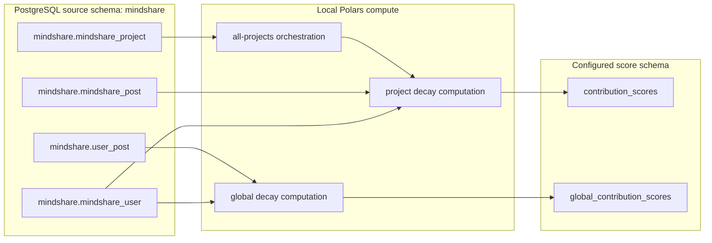
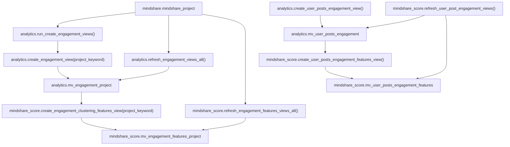

# Mindshare Database Object Dependencies

This document maps the PostgreSQL-side objects in `Mindshare_Backend/` and how
they depend on one another.

Current architecture decision:

- Decay score computation is owned by the Polars pipeline in `mindshare_compute`.
- Analytics materialized views, derived feature views, and query functions remain
  owned by PostgreSQL.

The SQL source tree uses these main schemas:

- `mindshare`: source/base tables
- `analytics`: engagement materialized views and analytics-facing functions
- `mindshare_score`: score tables, derived feature materialized views, and
  leaderboard/metrics functions

## High-Level Flows

Project analytics flow:

```text
mindshare.mindshare_post
mindshare.mindshare_user
  -> analytics.mv_engagement_<project>
  -> mindshare_score.mv_engagement_features_<project>
  -> mindshare_score.get_v2_analytics
  -> mindshare_score.get_mindshare_leaderboard
  -> mindshare_score.get_private_mindshare_leaderboard
```

Global user-post analytics flow:

```text
mindshare.user_post
mindshare.mindshare_user
  -> analytics.mv_user_posts_engagement
  -> mindshare_score.mv_user_posts_engagement_features
  -> analytics.get_all_users_analytics
  -> analytics.get_user_analytics
  -> analytics.get_user_posts_analytics
```

Decay score flow:

```text
mindshare.mindshare_post + mindshare.mindshare_user
  -> Polars project decay
  -> mindshare_score.contribution_scores
  -> leaderboard/project metric functions
```

```text
mindshare.user_post + mindshare.mindshare_user
  -> Polars global decay
  -> mindshare_score.global_contribution_scores
  -> global/user analytics functions
```

Legacy SQL decay functions still exist in the SQL tree, but the current runtime
path is the Polars pipeline.

## Detailed Dependency Diagrams

The diagrams below use logical object names for project-specific dynamic views:

- `analytics.mv_engagement_project` means the per-project materialized view
  created as `analytics.mv_engagement_<normalized_project_keyword>`.
- `mindshare_score.mv_engagement_features_project` means the matching
  per-project feature materialized view.

### Project Analytics and Leaderboard Flow

```mermaid
flowchart TD
    mindshare_post["mindshare.mindshare_post"]
    mindshare_user["mindshare.mindshare_user"]
    mindshare_project["mindshare.mindshare_project"]
    project_post_cap["mindshare.project_post_cap"]
    project_private_kol["mindshare.project_private_kol"]

    create_engagement["analytics.create_engagement_view(project_keyword)"]
    run_create_engagement["analytics.run_create_engagement_views()"]
    refresh_engagement["analytics.refresh_engagement_views_all()"]
    mv_engagement["analytics.mv_engagement_project"]

    create_features["mindshare_score.create_engagement_clustering_features_view(project_keyword)"]
    refresh_features["mindshare_score.refresh_engagement_features_views_all()"]
    mv_features["mindshare_score.mv_engagement_features_project"]

    contribution_scores["mindshare_score.contribution_scores"]
    polars_project_decay["Polars project decay pipeline"]

    get_v2_analytics["mindshare_score.get_v2_analytics()"]
    get_leaderboard["mindshare_score.get_mindshare_leaderboard()"]
    get_private_leaderboard["mindshare_score.get_private_mindshare_leaderboard()"]
    account_metrics["mindshare_score.get_account_level_metrics()"]
    post_metrics["mindshare_score.get_post_level_metrics()"]
    engagement_ratios["mindshare_score.get_post_engagement_ratios()"]
    smart_reach["mindshare_score.get_single_post_smart_reach()"]
    unique_reach["mindshare_score.get_account_and_keyword_unique_reach_ratio()"]

    mindshare_project --> run_create_engagement
    run_create_engagement --> create_engagement
    mindshare_post --> create_engagement
    mindshare_user --> create_engagement
    create_engagement --> mv_engagement
    refresh_engagement --> mv_engagement
    mindshare_project --> refresh_engagement

    mv_engagement --> create_features
    create_features --> mv_features
    refresh_features --> mv_features

    mindshare_post --> polars_project_decay
    mindshare_user --> polars_project_decay
    polars_project_decay --> contribution_scores

    mv_engagement --> get_v2_analytics
    mv_features --> get_v2_analytics
    contribution_scores --> get_v2_analytics
    mindshare_post --> get_v2_analytics
    mindshare_user --> get_v2_analytics

    mv_engagement --> get_leaderboard
    contribution_scores --> get_leaderboard
    project_post_cap --> get_leaderboard
    mindshare_post --> get_leaderboard
    mindshare_user --> get_leaderboard

    mv_engagement --> get_private_leaderboard
    contribution_scores --> get_private_leaderboard
    project_post_cap --> get_private_leaderboard
    project_private_kol --> get_private_leaderboard
    mindshare_post --> get_private_leaderboard
    mindshare_user --> get_private_leaderboard

    mv_engagement --> account_metrics
    contribution_scores --> account_metrics
    mv_engagement --> post_metrics
    contribution_scores --> post_metrics
    mv_engagement --> engagement_ratios
    mv_engagement --> smart_reach
    contribution_scores --> smart_reach
    mv_engagement --> unique_reach
```



### Global User-Post Analytics Flow

```mermaid
flowchart TD
    user_post["mindshare.user_post"]
    mindshare_user["mindshare.mindshare_user"]

    create_user_posts_view["analytics.create_user_posts_engagement_view()"]
    mv_user_posts["analytics.mv_user_posts_engagement"]

    create_user_posts_features["mindshare_score.create_user_posts_engagement_features_view()"]
    refresh_user_posts_features["mindshare_score.refresh_user_post_engagement_views()"]
    mv_user_posts_features["mindshare_score.mv_user_posts_engagement_features"]

    polars_global_decay["Polars global decay pipeline"]
    global_scores["mindshare_score.global_contribution_scores"]

    get_all_users["analytics.get_all_users_analytics()"]
    get_user["analytics.get_user_analytics()"]
    get_user_posts["analytics.get_user_posts_analytics()"]
    clustering["mindshare_score.get_user_post_engagement_clustering()"]
    global_account_metrics["mindshare_score.get_global_account_level_metrics()"]
    global_post_metrics["mindshare_score.get_global_post_level_metrics()"]
    global_ratios["mindshare_score.get_global_post_engagement_ratios()"]
    global_unique_reach["mindshare_score.get_global_unique_reach_increase()"]

    user_post --> create_user_posts_view
    mindshare_user --> create_user_posts_view
    create_user_posts_view --> mv_user_posts

    mv_user_posts --> create_user_posts_features
    create_user_posts_features --> mv_user_posts_features
    refresh_user_posts_features --> mv_user_posts
    refresh_user_posts_features --> mv_user_posts_features

    user_post --> polars_global_decay
    mindshare_user --> polars_global_decay
    polars_global_decay --> global_scores

    user_post --> get_all_users
    mindshare_user --> get_all_users
    mv_user_posts_features --> get_all_users
    global_scores --> get_all_users

    user_post --> get_user
    mindshare_user --> get_user
    mv_user_posts_features --> get_user

    user_post --> get_user_posts
    mindshare_user --> get_user_posts
    mv_user_posts_features --> get_user_posts
    global_scores --> get_user_posts

    mv_user_posts_features --> clustering
    user_post --> global_account_metrics
    mindshare_user --> global_account_metrics
    user_post --> global_post_metrics
    mindshare_user --> global_post_metrics
    user_post --> global_ratios
    user_post --> global_unique_reach
    mindshare_user --> global_unique_reach
```



### Decay Score Ownership Flow



### Object Creation and Refresh Orchestration



## `mindshare` Schema

### Core Source Tables

| Object | Role | Important Consumers |
|---|---|---|
| `mindshare.mindshare_post` | Project-scoped posts, replies, quotes, and repost metadata. Partitioned by `project_keyword`. | Project decay, `analytics.mv_engagement_<project>`, project leaderboard functions, project feature views |
| `mindshare.user_post` | Global/user-post table used by global analytics and global decay. | `analytics.mv_user_posts_engagement`, global decay, user analytics functions |
| `mindshare.mindshare_user` | X/Twitter user metadata and score. | Decay computation, engagement views, leaderboard functions, analytics functions |
| `mindshare.mindshare_project` | Project registry and status. | `analytics.run_create_engagement_views`, `analytics.refresh_engagement_views_all`, Polars `all-projects`, feature-view orchestration |
| `mindshare.project_post_cap` | Post cap settings by project and leaderboard type. | `mindshare_score.get_mindshare_leaderboard`, `get_private_mindshare_leaderboard` |
| `mindshare.project_private_kol` | Private KOL/project user list. | Private leaderboard flows |
| `mindshare.nucleus_post` / `mindshare.nucleus_user` | Nucleus source objects. | `get_post_from_user_id`, `get_user_engagement_quality` |
| `mindshare.post_content_signal` | Post content signal storage. | No direct dependency found in the inspected analytics/score functions |
| `mindshare.api_key`, `mindshare.admin`, `mindshare."user"` | Application/admin support tables. | Application auth/admin flows, not central to analytics dependency chain |
| `mindshare.contamination_cleanup_20260526` | Cleanup/audit table. | Operational table, not central to analytics dependency chain |

### Existing Source Indexes

`mindshare.mindshare_post`:

- `ix_mindshare_post_post_created_at`
- `ix_mindshare_post_post_id`
- `ix_mindshare_post_user_x_id_time`
- Recommended decay-read indexes are in
  `Mindshare_Backend/Mindshare_score/Indexes/decay_source_read_indexes.sql`.

`mindshare.user_post`:

- `idx_user_post_replied_post_id_time`
- `idx_user_post_root_post_id`
- `idx_user_post_user_x_id_time`
- `ix_user_post_post_created_at`
- `ix_user_post_post_id`
- `ix_user_post_quoted_post_id`
- `ix_user_post_replied_post_id`
- `ix_user_post_user_x_id_time`
- Recommended additions for decay/global analytics are in
  `Mindshare_Backend/Mindshare_score/Indexes/decay_source_read_indexes.sql`.

`mindshare.mindshare_user`:

- Primary key on `x_id`
- `ix_mindshare_mindshare_user_x_username`

## `analytics` Schema

### Engagement Materialized Views

#### `analytics.mv_engagement_<project>`

Created by:

- `Analytics/functions/create_engagement_view.sql`

Orchestrated by:

- `Analytics/functions/run_create_engagement_views.sql`

Refreshed by:

- `Analytics/functions/refresh_engagement_views_all.sql`

Depends on:

- `mindshare.mindshare_post`
- `mindshare.mindshare_user`

Shape:

- One materialized view per project.
- View name is `mv_engagement_` plus `LOWER(REPLACE(project_keyword, ' ', '_'))`.
- Matches reply engagements and quote engagements to project roots.
- Adds rows for roots with no engagement.

Indexes created by the procedure:

- Unique index on `engaged_tweet_id`
- Index on `root_post_id`
- Index on `engaged_user_id`

Primary consumers:

- `mindshare_score.create_engagement_clustering_features_view`
- `mindshare_score.get_mindshare_leaderboard`
- `mindshare_score.get_private_mindshare_leaderboard`
- `mindshare_score.get_v2_analytics`
- `mindshare_score.get_account_level_metrics`
- `mindshare_score.get_post_level_metrics`
- `mindshare_score.get_post_engagement_ratios`
- `mindshare_score.get_single_post_smart_reach`
- `mindshare_score.get_account_and_keyword_unique_reach_ratio`

#### `analytics.mv_user_posts_engagement`

Created by:

- `Analytics/functions/create_user_posts_engagement_view.sql`

Refreshed by:

- `Mindshare_score/Fuctions/refresh_user_post_engagement_views.sql`

Depends on:

- `mindshare.user_post`
- `mindshare.mindshare_user`

Shape:

- Global/user-post engagement materialized view.
- Matches replies, quotes, and retweets to root user posts.
- Adds `engaged_user_score`.

Indexes created by the procedure:

- Index on `root_post_id`
- Index on `root_user_id`

Primary consumers:

- `mindshare_score.create_user_posts_engagement_features_view`
- `mindshare_score.mv_user_posts_engagement_features`

### Analytics Functions and Procedures

| Object | Type | Depends On | Purpose |
|---|---|---|---|
| `analytics.create_engagement_view(project_keyword)` | Procedure | `mindshare.mindshare_post`, `mindshare.mindshare_user` | Creates one `mv_engagement_<project>` materialized view and indexes |
| `analytics.run_create_engagement_views()` | Procedure | `mindshare.mindshare_project`, `analytics.create_engagement_view` | Loops projects and creates project engagement views |
| `analytics.refresh_engagement_views_all()` | Procedure | `mindshare.mindshare_project`, `analytics.mv_engagement_<project>` | Refreshes existing project engagement materialized views |
| `analytics.create_user_posts_engagement_view()` | Procedure | `mindshare.user_post`, `mindshare.mindshare_user` | Creates global `mv_user_posts_engagement` |
| `analytics.get_all_users_analytics(limit_per_user)` | Function | `mindshare.user_post`, `mindshare.mindshare_user`, `mindshare_score.mv_user_posts_engagement_features`, `mindshare_score.global_contribution_scores` | Global analytics rollup for all users |
| `analytics.get_user_analytics(target_user_id, limit_cnt)` | Function | `mindshare.user_post`, `mindshare.mindshare_user`, `mindshare_score.mv_user_posts_engagement_features` | Analytics rollup for one user |
| `analytics.get_user_posts_analytics(p_user_id, startdate, enddate)` | Function | `mindshare.user_post`, `mindshare.mindshare_user`, `mindshare_score.global_contribution_scores`, `mindshare_score.mv_user_posts_engagement_features` | Global user-post analytics for one user/time window |
| `analytics.get_v2_user_posts_analytics(user_id, projectname, startdate, enddate)` | Function | dynamic `analytics.mv_engagement_<project>`, dynamic `mindshare_score.mv_engagement_features_<project>`, `mindshare_score.contribution_scores`, `mindshare.mindshare_user` | Project-specific user-post analytics |

## `mindshare_score` Schema

### Score Tables

#### `mindshare_score.contribution_scores`

Produced by:

- Current: Polars project decay pipeline writes to the configured score schema.
- Legacy SQL: `mindshare_score.calculate_decay_scores` and
  `calculate_all_decay_scores`.

Depends on source data:

- `mindshare.mindshare_post`
- `mindshare.mindshare_user`

Primary consumers:

- `get_mindshare_leaderboard`
- `get_private_mindshare_leaderboard`
- `get_v2_analytics`
- `get_post_level_metrics`
- `get_single_post_smart_reach`
- `get_account_level_metrics`
- `get_global_post_level_metrics` currently references `contribution_scores` in
  the SQL tree.

Existing indexes:

- `(project_keyword, original_author_x_id)`
- `(project_keyword, replier_x_id)`
- `original_post_id`
- `post_created_at`
- `reply_post_id`

#### `mindshare_score.global_contribution_scores`

Produced by:

- Current: Polars global decay pipeline writes to the configured score schema.
- Legacy SQL: `calculate_global_decay_scores` and
  `calculate_all_global_decay_scores`.

Depends on source data:

- `mindshare.user_post`
- `mindshare.mindshare_user`

Primary consumers:

- `analytics.get_all_users_analytics`
- `analytics.get_user_posts_analytics`

Existing indexes:

- `original_author_x_id`
- `original_post_id`
- `post_created_at`
- `replier_x_id`
- `reply_post_id`

### Derived Feature Materialized Views

#### `mindshare_score.mv_engagement_features_<project>`

Created by:

- `create_engagement_clustering_features_view(project_keyword)`
- `test_create_engagement_clustering_features_view(project_keyword)` for test
  flows

Orchestrated/refreshed by:

- `calculate_all_engagement_clustering_views`
- `refresh_engagement_features_views_all`

Depends on:

- Dynamic `analytics.mv_engagement_<project>`

Primary consumers:

- `get_v2_analytics`
- `get_engagement_clustering`
- `get_v2_user_posts_analytics`

Indexes:

- Unique index on `root_post_id`

#### `mindshare_score.mv_user_posts_engagement_features`

Created by:

- `create_user_posts_engagement_features_view`

Refreshed by:

- `refresh_user_post_engagement_views`

Depends on:

- `analytics.mv_user_posts_engagement`

Primary consumers:

- `analytics.get_all_users_analytics`
- `analytics.get_user_analytics`
- `analytics.get_user_posts_analytics`
- `mindshare_score.get_user_post_engagement_clustering`

Indexes:

- Unique index on `root_post_id`

### Score and Analytics Functions

#### Legacy Decay SQL Functions

These exist in the SQL tree but are superseded operationally by the Polars decay
pipeline:

- `calculate_decay_scores(project_keyword, reset_interval)`
- `calculate_all_decay_scores(reset_interval)`
- `calculate_global_decay_scores(reset_interval)`
- `calculate_all_global_decay_scores(reset_interval)`

They write to:

- `mindshare_score.contribution_scores`
- `mindshare_score.global_contribution_scores`

#### Project Leaderboard and Metrics

| Object | Depends On | Purpose |
|---|---|---|
| `get_mindshare_leaderboard(startdate, enddate, projectname)` | dynamic `analytics.mv_engagement_<project>`, `mindshare_score.contribution_scores`, `mindshare.project_post_cap`, `mindshare.mindshare_post`, `mindshare.mindshare_user` | Public project leaderboard |
| `get_private_mindshare_leaderboard(...)` | dynamic `analytics.mv_engagement_<project>`, `mindshare_score.contribution_scores`, `mindshare.project_post_cap`, `mindshare.project_private_kol`, `mindshare.mindshare_post`, `mindshare.mindshare_user` | Private/project-filtered leaderboard |
| `get_v2_analytics(projectname, startdate, enddate, sort_key, private_user_ids)` | `mindshare.mindshare_post`, dynamic `analytics.mv_engagement_<project>`, dynamic `mindshare_score.mv_engagement_features_<project>`, `mindshare_score.contribution_scores`, `mindshare.mindshare_user` | Project analytics API payload |
| `get_account_level_metrics(startdate, enddate, projectname)` | dynamic `analytics.mv_engagement_<project>`, `mindshare.user_post`, `mindshare.mindshare_post`, `mindshare_score.contribution_scores`, `mindshare.mindshare_user` | Account-level project metrics |
| `get_post_level_metrics(startdate, enddate, projectname)` | dynamic `analytics.mv_engagement_<project>`, `mindshare.mindshare_post`, `mindshare_score.contribution_scores`, `mindshare.mindshare_user` | Post-level project metrics |
| `get_post_engagement_ratios(startdate, enddate, projectname)` | dynamic `analytics.mv_engagement_<project>`, `mindshare.mindshare_post` | Post engagement ratios |
| `get_single_post_smart_reach(target_post_id, projectname, startdate, enddate)` | dynamic `analytics.mv_engagement_<project>`, `mindshare.mindshare_post`, `mindshare_score.contribution_scores`, `mindshare.mindshare_user` | Smart reach for one post |
| `get_account_and_keyword_unique_reach_ratio(startdate, enddate, projectname)` | dynamic `analytics.mv_engagement_<project>`, `mindshare.user_post` | Account/keyword reach ratio |
| `get_unique_reach_increase(startdate, enddate, projectname)` | dynamic `analytics.mv_engagement_<project>`, `mindshare.mindshare_user` | Project unique reach increase |
| `get_user_level_unique_reach_increase_flag(startdate, enddate, projectname)` | `get_unique_reach_increase` | User-level unique reach flag |

#### Global/User Analytics Functions

| Object | Depends On | Purpose |
|---|---|---|
| `get_global_account_level_metrics(startdate, enddate)` | `mindshare.user_post`, `mindshare.mindshare_user`, `mindshare_score.contribution_scores` | Global account-level metrics |
| `get_global_post_level_metrics(startdate, enddate)` | `mindshare.user_post`, `mindshare.mindshare_user`, `mindshare_score.contribution_scores` | Global post-level metrics |
| `get_global_post_engagement_ratios(startdate, enddate)` | `mindshare.user_post` | Global post engagement ratios |
| `get_global_unique_reach_increase(startdate, enddate)` | `mindshare.user_post`, `mindshare.mindshare_user` | Global unique reach increase |
| `get_global_user_level_unique_reach_increase_flag(startdate, enddate)` | `get_global_unique_reach_increase` | Global user-level unique reach flag |
| `get_user_post_engagement_clustering(user_id, start_ts, end_ts)` | `mindshare_score.mv_user_posts_engagement_features` | User-post engagement clustering output |
| `get_user_engagement_quality(p_user_ids)` | `mindshare.nucleus_post`, `mindshare.mindshare_user` | Engagement quality for supplied users |
| `get_post_from_user_id(p_user_x_id, project_name, table_name)` | `mindshare.mindshare_project`, `mindshare.mindshare_post`, `mindshare.user_post`, `mindshare.nucleus_post` | Finds posts by user from one or more post tables |

## Operational Build/Refresh Order

Initial setup or definition changes:

```text
1. Create/maintain source tables in mindshare.
2. Populate/refresh mindshare.mindshare_user, mindshare.mindshare_post, user_post.
3. Run analytics.create_engagement_view(project) or analytics.run_create_engagement_views().
4. Run analytics.create_user_posts_engagement_view().
5. Run mindshare_score.create_engagement_clustering_features_view(project).
6. Run mindshare_score.create_user_posts_engagement_features_view().
7. Run Polars decay pipeline for project/global contribution score tables.
8. Query leaderboard and analytics functions.
```

Normal data refresh:

```text
1. New source rows land in mindshare tables.
2. Refresh analytics materialized views.
3. Refresh mindshare_score feature materialized views.
4. Run Polars decay refresh for project/global score tables.
5. Query API/leaderboard functions.
```

Important distinction:

- `CREATE MATERIALIZED VIEW` / `DROP MATERIALIZED VIEW` should be used for
  initial creation or query-definition changes.
- `REFRESH MATERIALIZED VIEW` should be used for normal new data.
- PostgreSQL materialized views do not refresh incrementally by default; refresh
  recomputes the view contents.
